# Thurin brand kit

Marks, wordmarks, colours, and type for **Thurin.id** (the product) and **Thurin Labs** (the company). Take what you need.

  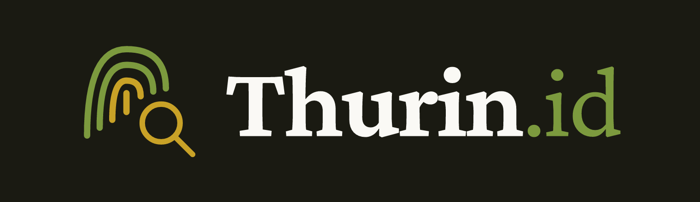
  &nbsp;&nbsp;
  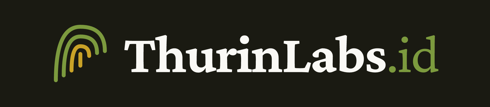

## Names

| | Say | Wordmark | Line |
|---|---|---|---|
| The product | **Thurin.id** | Thurin**.id** | PGP keys on Ethereum · Old trust – new ground |
| The company | **Thurin Labs** | ThurinLabs**.id** | Prove more. Reveal less. |

Never bare "Thurin" for the product. The CLI command is `thurin`; the site is thurin.id; the company site is thurinlabs.id.

## Marks

A fingerprint of green and gold arcs. Thurin Labs uses it alone; Thurin.id adds a gold magnifying glass.

| File | What |
|---|---|
| `marks/thurin-labs.svg`, `marks/thurin-id.svg` | the marks, transparent, tight box |
| `marks/*-512.png` | the same as PNG |
| `marks/*-tile-dark.svg`, `*-tile-light.svg` (+ `-1024.png`) | square, padded, on the ground: avatars, favicons, app icons |

The mark keeps its colours (`#7c9a3e`, `#c9a227`) on dark and light grounds.

## Wordmarks and lockups

Crimson Pro: the name in bold, a lighter `.id` in green. Letters are outlined in the SVGs, so no font is needed.

| File | What |
|---|---|
| `wordmarks/thurin-id-{dark,light}.svg`, `wordmarks/thurinlabs-id-{dark,light}.svg` (+ `.png`) | the wordmark alone, transparent; `dark` is for dark grounds |
| `lockups/thurin-id-{dark,light}.svg`, `lockups/thurinlabs-id-{dark,light}.svg` (+ `.png`) | mark + wordmark on the ground |

## Social

| File | Size |
|---|---|
| `social/header-{thurin-id,thurinlabs-id}-{dark,light}-1500x500.png` | X / social header |
| `social/og-{thurin-id,thurinlabs-id}-{dark,light}-1200x630.png` | link preview |

## Colours

The sites have two modes; these are their colours.

| | Dark | Light |
|---|---|---|
| Ground | 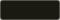 `#1a1a12` | 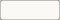 `#faf9f5` |
| Surface | 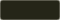 `#252518` | 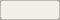 `#f0efe8` |
| Deep surface | 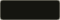 `#151510` | 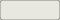 `#e8e7e0` |
| Border | 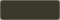 `#3a3a2a` | 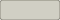 `#d0cfc4` |
| Text |  `#faf9f5` | 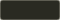 `#2a2a22` |
| Muted text | 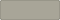 `#a8a598` | 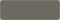 `#6b6960` |
| Green (primary) | 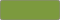 `#7c9a3e` | 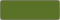 `#5a7228` |
| Gold (accent) | 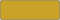 `#c9a227` | 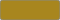 `#a8861e` |

## Type

| Use | Font |
|---|---|
| Headings | **Cinzel** (700) |
| Body and the wordmarks | **Crimson Pro** (400, 700) |
| Code, fingerprints, labels | **Share Tech Mono** |
| Card images | Inter and JetBrains Mono |

All free (SIL Open Font License).

## Please

- Give the marks room; keep them on a plain ground.
- Don't recolour, stretch, or add effects.
- Link to thurin.id when you show the Thurin.id mark.

## License

© Thurin Labs LLC. You may use these to refer to Thurin.id and Thurin Labs.
